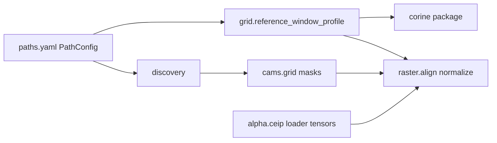

# `PROXY/core` — shared infrastructure

This package holds **cross-sector** building blocks: CAMS grids and masks, CORINE decoding, CEIP / alpha ingestion, raster alignment, path discovery, and small I/O helpers. Sector code under `PROXY/sectors/<Sector>/` should call into `core` instead of re-implementing the same geometry, masking, or normalization logic.

---

## Layout (subpackages)

| Path | Role |
|------|------|
| [`alpha/`](alpha/) | Reported-emissions workbook parsing, CEIP share tensors, off-road triple legs, YAML alpha fallbacks, and the optional `compute_alpha` CLI aggregation. |
| [`ceip/`](ceip/) | CEIP profile index (`index.yaml` resolution), reported-group alpha loaders (`reported_group_alpha.py`). |
| [`cams/`](cams/) | **Canonical** CAMS NetCDF helpers: bounds, cell-id grids, source masks, GNFR/source-type filters, country + domain filters (`cell_id.py`, `domain.py`, `gnfr.py`, `grid.py`, `mask.py`). |
| [`corine/`](corine/) | **Canonical** CORINE helpers: pixel encoding / Level-3 class lookup (`encoding.py`) plus raster windowing, warping, and class masks (`raster.py`). |
| [`dataloaders/`](dataloaders/) | Repo root discovery, `paths.yaml` loading, path resolution, CORINE/CAMS discovery, thin tabular/raster/emissions wrappers. |
| [`raster/`](raster/) | Reference-grid warping (`align.py`), CAMS-cell normalization (`normalize.py`), GeoTIFF writes (`write.py`), NUTS country rasterization for masks (`country_clip.py`). |

Top-level modules (same directory as this README) glue subpackages to common use cases (e.g. `grid.py`, `matching.py`) or provide temporary compatibility shims for old import paths.

---

## Module guide (by file)

### CAMS and allocation

- **`cams/domain.py`** — `country_index_1based`, `domain_mask_wgs84`: locate a country in CAMS `country_id` and build lon/lat masks with optional WGS84 bbox. **Single source of truth** for these two functions.
- **`cams/gnfr.py`** — `GNFR_ORDER`, `gnfr_code_to_index`: CAMS emission-category letter codes (F → F1..F4). **Single source of truth** for GNFR index mapping.
- **`cams/grid.py`** — `read_cams_bounds`, `build_cam_cell_id`, masked variants, `cams_source_mask`, index grids: vectorized CAMS cell geometry and emission-category filtering.
- **`cams/cell_id.py`** — Legacy-compatible `build_cams_cell_id_raster` implementation for GNFR/source-type/country-masked CAMS geographic cell ids.
- **`cams/mask.py`** — `cams_gnfr_country_source_mask`, `other_combustion_area_mask`: source-row masks for visualization and diagnostics.
- **`cams_source_mask.py`** — Deprecated shim for old imports; use `cams.mask` and `cams.gnfr`.
- **`area_allocation.py`** — Alpha matrix finalization, weight stacking (`allocate_weights_from_normalized_stack`), per-cell subsector normalization. Deprecated shim for `build_cams_cell_id_raster`.

### CORINE

- **`corine/encoding.py`** — Decode raster pixels to CLC Level-3 (`eea44_index` vs physical codes), LUT cache, `build_clc_indicators` for morphology triples.
- **`corine/raster.py`** — Windowed read / warp CORINE to a reference profile, binary masks by CLC code list, adapted masks when YAML class lists differ from raster legend.
- **`corine_pixels.py`**, **`corine_masks.py`** — Deprecated shims for old imports.

### OSM + proxy geometry

- **`osm_corine_proxy.py`** — OSM rule filtering, line coverage fractions, CORINE class scores, combined P_pop / group stacks for industry-style proxies.
- **`osm_lines.py`** — Buffered line coverage helper.
- **`sectors/I_Offroad/proxy_rules.py`** — Offroad-owned OSM railway filter sets from `paths.yaml` (`proxy_rules.osm_railway`); `core/proxy_rules.py` is a deprecated shim.

### Raster stack (shared)

- **`raster/align.py`** — `warp_to_ref`, `warp_sum_to_ref`, `warp_raster_to_ref`, `ref_profile_to_kwargs`: rasterio reproject onto `ref` dict (height, width, transform, crs).
- **`raster/normalize.py`** — `normalize_within_cams_cells`, quantile min–max, stack normalization, weight-sum validation (CAMS-cell–wise).
- **`raster/write.py`** — Multiband GeoTIFF writer.
- **`dataloaders/raster.py`** — Public façade: delegates `ref_profile_to_kwargs` / `warp_raster_to_ref` to `raster.align` plus `read_band`, `warp_band_to_ref`, grid assertions.

### Grid / reference window

- **`grid.py`** — `reference_window_profile` (CORINE + NUTS pad), `nuts2_for_country`, `resolve_nuts_cntr_code`.
- **`ref_profile.py`** — Resolve CORINE path from config, `load_area_ref_profile` for sector pipelines that need a dict profile.

### CEIP / alpha (reported emissions)

- **`alpha/ceip/loader.py`** — Load `config/ceip/index.yaml`, remap legacy profile paths, `default_ceip_profile_relpath`, shared pollutant-alias path.
- **`alpha/ceip/reported_group_alpha.py`** — Read CEIP / workbook long tables, map sectors → groups or subsectors, build alpha tensors, solvents-specific loader.
- **`alpha/ceip/alpha_method_engine.py`** — `alpha_methods.yaml` methods 0–4 → α tensors.
- **`alpha/ceip/profile_merge.py`** — Deep-merge groups + rules YAML profiles.
- **`alpha/workbook.py`** — Parse multi-sheet / semicolon alpha XLSX to a standard dataframe.
- **`alpha/workbook_aggregation_spec.py`** — Rebuild GNFR totals + grouped NFR codes for `compute_alpha` from `ceip/profiles/*.yaml` (no duplicate YAML files).
- **`alpha/compute.py`** — `compute_alpha` workbook diagnostic (country × pollutant α means).
- **`alpha/fallback.py`** — YAML resolver merging reported values with `ceip/alpha/fallback/*.yaml`.
- **`alpha/reported.py`**, **`alpha/aliases.py`**, **`alpha/_common.py`** — Country/sector/pollutant token helpers and small YAML/parse utilities.

GNFR I offroad triple-leg shares: `PROXY.core.alpha.ceip.load_ceip_and_alpha` + `PROXY.sectors.I_Offroad.share_broadcast` (not separate `alpha/` readers).

### Data loading and discovery

- **`dataloaders/config.py`** — `project_root`, `resolve_path`, `load_yaml` (root mapping must be a dict), `PathConfig` / `load_path_config`.
- **`dataloaders/discovery.py`** — `discover_corine`, `discover_cams_emissions` (prefer `INPUT/` when configured paths are missing).
- **`dataloaders/emissions.py`**, **`tabular.py`**, **`vector.py`** — Thin `xarray` / `pandas` / `geopandas` helpers.

### Country masks and CAMS alignment

- **`raster/country_clip.py`** — NUTS-based country union, `rasterize_country_ids`, ISO3 resolution helpers for CAMS vs CLI country codes.
- **`country_raster.py`** — `rasterize_country_indices`: NUTS0-based integer country index raster + idx→ISO3 map (different contract than `rasterize_country_ids`; used where LEVL_CODE==0 polygons drive a coarse national mask).

### Other

- **`matching.py`** — EPRTR ↔ CAMS point matching CLI (`run_matching`), scoring YAML load.
- **`area_allocation.py`** — See above (alpha + CAMS cell id raster legacy path).
- **`io.py`** — `write_json`, `write_geotiff`, small path helpers.
- **`logging.py`**, **`logging_tables.py`**, **`diagnostics.py`** — Logging adapters and wide-table / raster QA helpers.

---

## Redundancy and consolidation notes

These are **intentional or historical overlaps** worth knowing before refactoring callers.

### 1. YAML loading (several flavors)

| Location | Behaviour |
|----------|-----------|
| `dataloaders/config.load_yaml` | Requires top-level **dict**; used for `paths.yaml` and strict configs. |
| `alpha/_common._load_yaml` | Alias to `dataloaders.config.load_yaml`; kept internal to alpha for import stability. |
| `matching.py` | Uses `dataloaders.config.load_yaml`; no local YAML loader. |
| `alpha/fallback._load_yaml_if_exists` | Soft load + empty dict on failure. |

**Suggestion:** Prefer `dataloaders.config.load_yaml` where a dict root is guaranteed; keep soft-loader only for optional overrides.

### 2. Sector / NFR token normalization

Inventory sector / NFR token normalization is centralized through `alpha/reported.normalize_inventory_sector`; `alpha/_common._norm_token` and CEIP reported-group loaders use that public helper.

### 3. Country index rasters

- `raster/country_clip.rasterize_country_ids` — union of country polygons with explicit `iso3` list per pixel value.
- `country_raster.rasterize_country_indices` — NUTS LEVL0 `CNTR_CODE` → index with `cntr_to_iso3` map.

**Not redundant:** different inputs and output semantics; do not merge without a spec change.

### 4. Resolved: CAMS country mask + GNFR index duplication

Previously `country_index_1based` / `domain_mask_wgs84` were copy-pasted in `area_allocation.py` and matched `cams/domain.py`. **`area_allocation` now re-exports from `cams.domain`.** Source-row masks live in `cams/mask.py`; `cams_source_mask.py` is only a deprecated compatibility shim.

### 5. `ref_profile_to_kwargs` / `warp_raster_to_ref`

Implemented in `raster/align.py`; `dataloaders/raster.py` wraps them for a stable sector-facing API. **Not redundant** — façade pattern.

### 6. CORINE: pixels vs masks

- `corine/encoding.py` — **values** (L3 decoding, LUT validation).
- `corine/raster.py` — **spatial** read/warp and boolean masks.

Clear separation; keep both.

---

## Suggested reading order (for new contributors)

1. `dataloaders/config.py` + `dataloaders/discovery.py` — how paths resolve.
2. `grid.py` + `ref_profile.py` — reference window dict.
3. `cams/domain.py`, `cams/gnfr.py`, `cams/grid.py` — CAMS cell logic.
4. `raster/normalize.py` + `raster/align.py` — weights on CAMS cells.
5. `alpha/ceip/loader.py` + `alpha/ceip/reported_group_alpha.py` — profile-driven alphas.
6. `alpha/fallback.py` — YAML override layer.

---

## Diagram (high level)

---

*Generated as part of a `PROXY/core` documentation pass; update this file when you add new `core` modules or change canonical import paths.*
