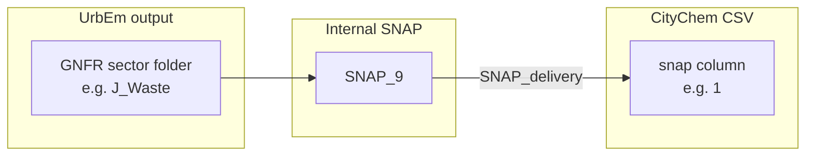
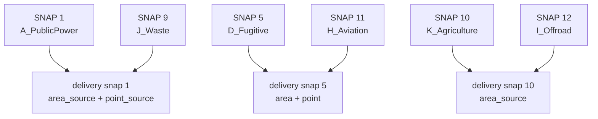
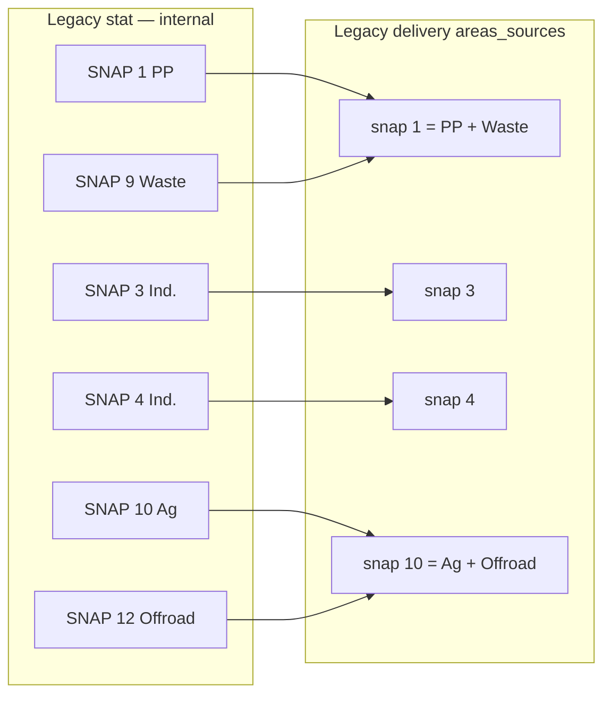

# SNAP ↔ GNFR mapping (Ioannina / `Transform_for_citychem`)

This document describes how emission sectors move from **UrbEm** outputs to **CityChem delivery CSVs**, and how that differs from **legacy internal stat** files used for validation.

Config source: [`config.yaml`](config.yaml).

---

## Three layers of “SNAP”

The same word *SNAP* is used at three different stages. Mixing them causes false mass gaps in comparisons.

| Layer | Where it appears | Meaning |
|-------|------------------|---------|
| **Internal SNAP** | `SNAP_TO_GNFR` keys (`SNAP_1` … `SNAP_12`) | Standard source category used inside UrbEm / proxy pipelines |
| **GNFR sector folder** | `Output/UrbEm/{City}/A_PublicPower`, `B_Industry`, … | CAMS-REG GNFR letter + UrbEm sector name |
| **Delivery SNAP** | `snap` column in `area_source_*.csv`, `line_source_*.csv`, `point_source_*.csv` | CityChem export code after **`SNAP_delivery`** remapping (sectors can be merged) |



---

## Internal SNAP → GNFR sector (`SNAP_TO_GNFR`)

Each internal SNAP maps to **one UrbEm sector folder** under `Output/UrbEm/{City}_{Year}/`.

| Internal SNAP | Standard label (short) | GNFR | UrbEm folder | In Ioannina run |
|---------------|------------------------|------|--------------|-----------------|
| 1 | Public power | A | `A_PublicPower` | yes |
| 2 | Residential / commercial combustion | C | `C_OtherCombustion` | yes |
| 3 | Industry combustion | B | `B_Industry` | yes |
| 5 | Fugitive emissions | D | `D_Fugitive` | yes |
| 6 | Solvents | E | `E_Solvents` | yes |
| 7 | Road transport | F | `F_Roads` | yes |
| 8 | Shipping / other mobile | G | `G_Shipping` | absent (no area weights) |
| 9 | Waste | J | `J_Waste` | yes |
| 10 | Agriculture | K | `K_Agriculture` | yes |
| 11 | Aviation | H | `H_Aviation` | yes (points only) |
| 12 | Off-road machinery | I | `I_Offroad` | yes |

**Note:** Internal **SNAP 4** (production processes) is **not** a separate UrbEm sector in the new pipeline. Legacy Ioannina v1 split industry into delivery SNAP **3 + 4** (80% / 20%); new `B_Industry` is a single sector mapped to internal SNAP **3** only.

---

## Delivery remapping (`SNAP_delivery`)

When writing CityChem CSVs, `transform.py` replaces the internal SNAP with the **delivery** code via `snap_tags()`:

```text
delivery_snap, zcor_sw, zcor_ne = snap_tags(cfg, internal_snap)
```

| Internal SNAP | Sector | Delivery `snap` in CSV | Effect |
|---------------|--------|--------------------------|--------|
| 1 | A_PublicPower | **1** | unchanged |
| 2 | C_OtherCombustion | **2** | unchanged |
| 3 | B_Industry | **3** | unchanged |
| 5 | D_Fugitive | **5** | unchanged |
| 6 | E_Solvents | **6** | unchanged |
| 7 | F_Roads | **7** | lines only (see below) |
| 8 | G_Shipping | **8** | not used for Ioannina |
| 9 | J_Waste | **1** | **merged into SNAP 1** |
| 10 | K_Agriculture | **10** | unchanged |
| 11 | H_Aviation | **5** | **merged into SNAP 5** |
| 12 | I_Offroad | **10** | **merged into SNAP 10** |

Merged rows are **summed** in the same CSV if they share the same grid cell (`merge_area_rows` / `merge_point_rows` group by `snap` + coordinates).



---

## Source type routing (area / line / point)

| Internal SNAP | Sector | UrbEm input | CityChem output | Units in CSV |
|---------------|--------|-------------|-----------------|--------------|
| 7 | F_Roads | `area_emission_grid.csv` | `line_source_{City}.csv` | **g/s** (OTM road segments) |
| 11 | H_Aviation | `point_emission_grid.csv` | `point_source_{City}.csv` | kg/yr (stack params) |
| others | * | `area_emission_grid.csv` | `area_source_{City}.csv` | kg/km²/yr |
| * (if points exist) | * | `point_emission_grid.csv` | `point_source_{City}.csv` | kg/yr |

Roads: 100 m grid → 1 km cells → disaggregated onto OTM line geometry → `line_source_*.csv`.

All other area sectors: 100 m grid summed to 1 km → `area_source_*.csv`.

---

## Vertical layer tags (`ZCOR_SW`, `ZCOR_NE`)

Area sources also get stack-height layer indices on the SW/NE corners:

| Internal SNAP | `zcor_sw` | `zcor_ne` (all sectors) |
|---------------|-----------|-------------------------|
| 1–5, 8–9, 11 | 10 | 10 |
| 6, 7, 10, 12 | 0 | 10 |

(`SNAP_4` entries in config exist for legacy compatibility; no UrbEm sector uses internal SNAP 4 in the new pipeline.)

---

## Legacy Ioannina v1 — what to compare for validation

Legacy results ship **two** SNAP views:

| File pattern | SNAP meaning | Use for |
|--------------|--------------|---------|
| `*_urbem_stat_areas_sources_*.csv` | **Internal SNAP** (1, 3, 4, 9, 10, 12, …) | Per-sector mass checks vs new UrbEm sectors |
| `*_areas_sources_*.csv` | **Delivery SNAP** (after merge: 1, 2, 3, 5, 6, 10) | End-to-end CSV comparison vs transformed `area_source_*.csv` |



**Correct comparisons**

| New sector | Compare legacy stat to | Do **not** compare to |
|------------|------------------------|------------------------|
| A_PublicPower | stat SNAP **1** | delivery snap **1** alone (includes waste) |
| J_Waste | stat SNAP **9** | delivery snap **1** |
| B_Industry | stat SNAP **3 + 4** combined | delivery snap **3** alone |
| K_Agriculture | stat SNAP **10** | delivery snap **10** (includes offroad) |
| I_Offroad | stat SNAP **12** | delivery snap **10** |
| H_Aviation | legacy points (empty Ioannina) | delivery snap **5** areas |

**Delivery-level check (merged SNAPs):**

Compare sums of `area_source_{City}.csv` + `line_source_{City}.csv` + `point_source_{City}.csv` to legacy `*_areas_sources_*` + `*_lines_sources_*` + `*_point_sources_*` — should agree within a few percent domain-wide.

Tool: `python Transform_for_citychem/compare_mass.py` (uses stat for internal rows; prints delivery totals separately).

---

## Quick reference — Ioannina config values

```yaml
# Internal SNAP → UrbEm folder
SNAP_TO_GNFR:
  SNAP_1: A_PublicPower      # GNFR A
  SNAP_2: C_OtherCombustion  # GNFR C
  SNAP_3: B_Industry         # GNFR B
  SNAP_5: D_Fugitive         # GNFR D
  SNAP_6: E_Solvents         # GNFR E
  SNAP_7: F_Roads            # GNFR F
  SNAP_8: G_Shipping         # GNFR G (absent Ioannina)
  SNAP_9: J_Waste            # GNFR J
  SNAP_10: K_Agriculture     # GNFR K
  SNAP_11: H_Aviation        # GNFR H
  SNAP_12: I_Offroad         # GNFR I

# Internal SNAP → delivery snap column in CityChem CSV
SNAP_delivery:
  SNAP_9: 1    # waste → public power bucket
  SNAP_11: 5   # aviation → fugitive bucket
  SNAP_12: 10  # offroad → agriculture bucket
  # all others: identity (1→1, 2→2, …)
```
